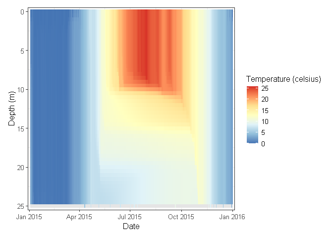

<!-- README.md is generated from README.Rmd. Please edit that file -->

# GLM3r - FLARE

[](https://github.com/FLARE-forecast/GLM3r/actions/workflows/check-standard.yaml)
[](https://github.com/FLARE-forecast/GLM3r)

R package for hosting
[GLM](http://aed.see.uwa.edu.au/research/models/GLM/) model running for
the [FLARE](https://flare-forecast.org/) project. `GLM3r` is designed to
hold the most current version of the General Lake Model (GLM) for linux,
mac, and windows platforms. This package does not contain the source
code for the model, only the executable, and functions for handling the
various platform requirements for running the model. Also, use
`glm_version()` to figure out what version of GLM you are running.

## Installation

You can install GLM3r from Github with:

``` r
# install.packages("devtools")
devtools::install_github("FLARE-forecast/GLM3r")
```

## Usage

### Run

``` r
library(GLM3r)

sim_folder <- system.file('extdata', package = 'GLM3r')

run_glm(sim_folder)
```

``` 

     Reading configuration from glm3.nml
     NOTE: values for crest_elev not provided, assuming max elevation, H[bsn]
     VolAtCrest= 494638433.64669; MaxVol= 494638433.64669 (m3)
Warning in met file, snowice is enabled but Snow column not found!
Directory "output" does not exist - attempting to create it
     
    -------------------------------------------------------
    |  General Lake Model (GLM)   Version 3.1.1           |
    -------------------------------------------------------
     
     glm built using MSC version 1916

     nDays= 730; timestep= 3600.000000 (s)
     Maximum lake depth is 24.993600
     Depth where flow will occur over the crest is 24.993600
     Sediment zones being set at    10.0    25.0     0.0 ... 

     Wall clock start time :  Wed Apr 28 15:59:36 2021

     Simulation begins...
     Running day  2457388, 100.00% of days complete

     Wall clock finish time : Wed Apr 28 15:59:37 2021
     Wall clock runtime was 1 seconds : 00:00:01 [hh:mm:ss]

    Model Run Complete
    -------------------------------------------------------
```

### Visualize

``` r
library(glmtools)

out_file <- file.path(sim_folder, 'output/output.nc')
plot_var(nc_file = out_file, var_name = 'temp')
```

<!-- -->
